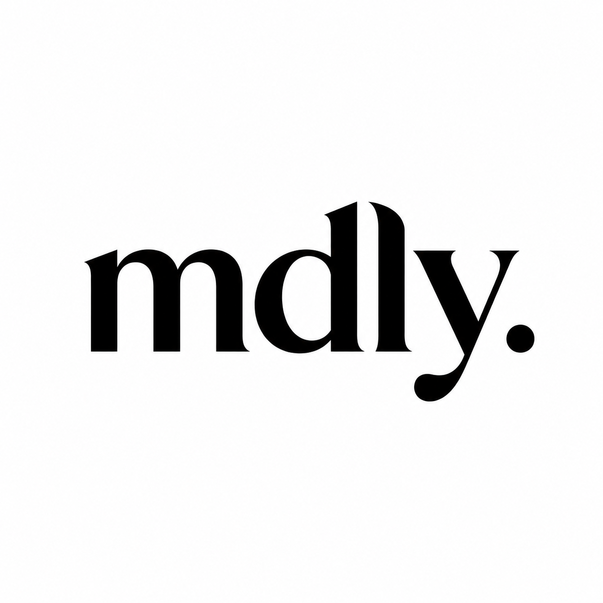

# mdly

<p align="center">
  
</p>

**A lightweight Markdown-first document editor.** Free, open source, and designed for fast local document workflows.

<p align="center">
  <a href="https://github.com/tektrg/mdly/releases/latest">Download</a>
  ·
  <a href="https://github.com/tektrg/mdly/releases">Releases</a>
  ·
  <a href="CONTRIBUTING.md">Contributing</a>
</p>

## What is mdly?

mdly is a free, open-source Markdown editor for you and your agents.

- **Feels familiar.** The same writing experience you're used to from Notion or Apple Notes, but for Markdown. `/` commands, Markdown shortcuts, and file properties / frontmatter are supported.
- **Agent ready.** Point your agent at your notes folder to start collaborating. mdly live-reloads as your agent edits.
- **Build any view.** Beyond Markdown, you can build and view HTML-based apps. [Install the skills](https://github.com/bholmesdev/hubble-skills) and tell your coding agent what to build. Turn a folder of notes into a table, a bookshelf, a map... anything you can think of.


mdly is a fork of [Hubble.md](https://github.com/bholmesdev/hubble.md) by Ben Holmes. It keeps the original MIT license notice and is moving in a separate product direction.

mdly may work with Notion exports or Notion-connected workflows, but it is not affiliated with, endorsed by, or sponsored by Notion Labs, Inc.

## Download

mdly ships as a desktop app. Install the latest build from the [releases page](https://github.com/tektrg/mdly/releases/latest).

macOS is supported today. Windows and Linux are not built yet, mostly because I haven't tested on those operating systems yet :) They should be straightforward to add, so contributions are welcome!

## Connect Notion

mdly can search, import, refresh, and explicitly push linked Notion pages as local Markdown files. Notion database imports are currently read-only table views.

Notion support uses the local [`ntn`](https://ntn.dev) CLI and its `ntn-acct` account wrapper. Set it up once on your Mac:

```sh
curl -fsSL https://ntn.dev | bash
ntn --version
```

Create a public Notion integration at [notion.so/my-integrations](https://www.notion.so/my-integrations), complete Notion's OAuth flow for the workspace you want to use, then store the OAuth access token under a local account name:

```sh
mkdir -p ~/.config/notion/accounts/7lab
printf '%s' '<your-oauth-access-token>' > ~/.config/notion/accounts/7lab/oauth_access_token
NOTION_ACCOUNT=7lab ntn-acct api v1/users/me
```

Use a different folder name, such as `work` or `personal`, for additional workspaces. mdly uses the `7lab` account by default, or the account you choose in the Notion dialog. Markdown sync requires an OAuth token; internal integration API keys are not enough for Notion's Markdown endpoints.

After setup:

1. Open mdly.
2. Use **Open Notion** from the toolbar or command bar.
3. Choose the Notion account if you have more than one.
4. Search for a page or database.
5. Open a page to create a linked Markdown file in the current folder, or open a database to create a read-only local table view.

Linked Notion pages stay local-first. Saving the Markdown file does not update Notion automatically; use **Push to Notion** when you want to send local changes back, and **Refresh from Notion** when you want to fetch the latest remote content.

## Compile from source

Want to build mdly directly? First, install the prerequisites:

- [Node.js](https://nodejs.org/en/download)
- [pnpm](https://pnpm.io/installation)
- macOS desktop builds: Xcode Command Line Tools via `xcode-select --install`

Then from the repo root:

```sh
pnpm install
pnpm bundle:desktop
```

This creates a production desktop bundle under `apps/desktop/release/`. For the live dev flow and packaging detail, see [`apps/desktop/README.md`](./apps/desktop/README.md).

## Repository structure

This repo is a pnpm workspace:

```text
.
├── apps
│   ├── desktop  # Electron desktop app (the main mdly app)
│   ├── web      # Astro landing page
│   └── www      # React + Convex web app (HEAVILY WIP)
└── packages
    ├── editor         # Framework-agnostic Markdown editor core (Tiptap + Markdown conversion)
    ├── ui             # Shared React editor UI built on the editor core
    ├── runtime        # Runtime injected into HTML Apps and Embeds
    ├── sync           # Filesystem sync engine (HEAVILY WIP)
    ├── convex-client  # Convex client used by the sync engine
    ├── sync-backend   # Convex backend powering Cloud Sync
    └── cli            # `hubble` CLI for syncing a folder from the terminal
```

## Common commands

From the repo root:

```sh
pnpm install          # install dependencies
pnpm dev:desktop      # run the desktop app in dev
pnpm dev:www          # run the web app in dev
pnpm build            # check, build all packages, and typecheck
pnpm bundle:desktop   # build a production desktop bundle
pnpm check            # run Biome
pnpm typecheck        # typecheck all packages
```

## Documentation

- [`CONTRIBUTING.md`](./CONTRIBUTING.md) covers the contribution flow, local setup, and pre-PR checks.
- [`CONTEXT.md`](./CONTEXT.md) is the shared glossary for project terms (Workspace, HTML App, Embed, and more).
- [`apps/desktop/README.md`](./apps/desktop/README.md) covers desktop build, dev, and packaging.

## Contributing

Contributions of any size are welcome. Open an issue before substantial work so we can agree on the approach together. See [`CONTRIBUTING.md`](./CONTRIBUTING.md) for the full flow.

This project follows our [Code of Conduct](./CODE_OF_CONDUCT.md). To report a security issue, see our [security policy](./SECURITY.md).

## License

mdly is licensed under the [MIT License](./LICENSE). The original Hubble.md copyright notice is retained in the license file.
